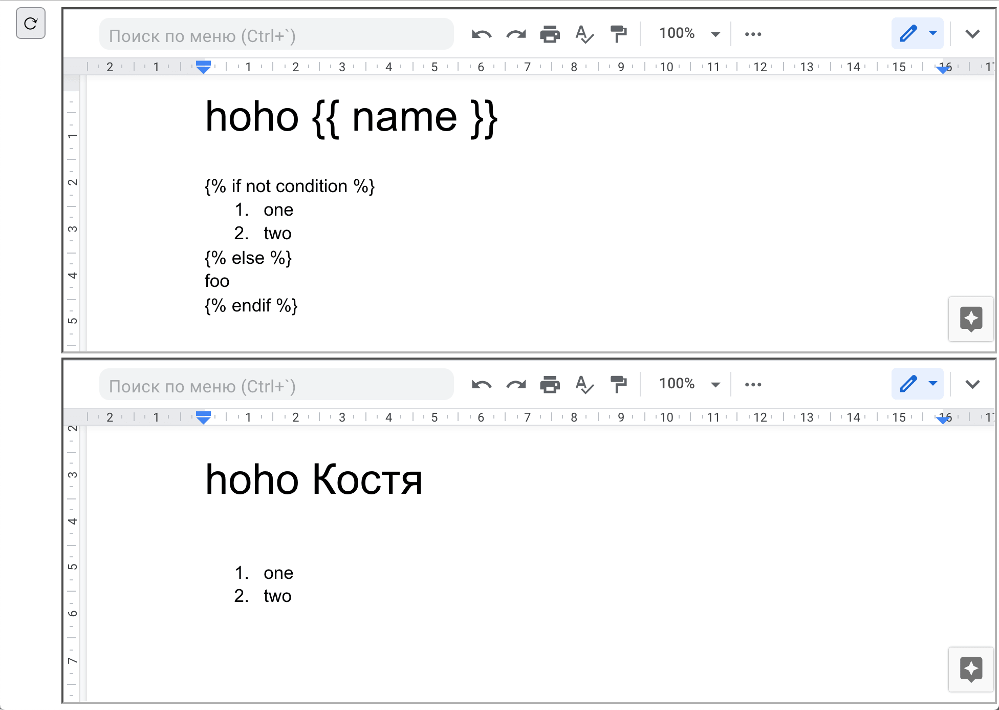

Edit and preview jinja2-powered templates in Google Docs
========================================================

This uses `python-docx-template <https://docxtpl.readthedocs.io/>`_
docx template engine (which is in turn based on Jinja2) to edit and preview
templates in Google Docs.

This is how it looks:

How to run
----------

You need to create a GCP service account with access to Drive API,
and put it's JSON credentials into ``service-account-credentials.json``
file.

Use Python 3.8+, install requirements from ``requirements.txt``,
start app (not for production) with ``./manage.py runserver``.
